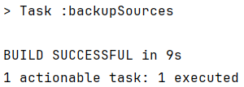
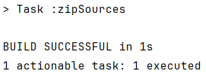

# CA2: Build Tools with Gradle

Start Date: 14, March

End Date: 8, April

[Git Repository](https://github.com/SwitchQA/devops-23-24-JPE-1222637)

## Part 1: Gradle Basic Demo

### Initial steps
* Download the project from [here](https://bitbucket.org/pssmatos/gradle_basic_demo/downloads/)
* Follow the steps in the readme file inside gradle_basic_demo folder

### Installing Gradle
* On Windows
    * Download the latest version of Gradle from [here](https://gradle.org/releases/)
    * unzip it
    * create a Gradle directory where you’ll be able to add any new versions of Gradle (e.g. C:\Gradle)
    * copy the unzipped directory there
    * update the PATH environment variable to include the Gradle /bin directory. Hit the Windows key, type environment variables, and hit enter. Select Environment Variables. Under System variables double click PATH . Select New and paste in the path to the bin directory (e.g. C:\Gradle\gradle-7.2\bin). Select OK three times.
    * To double-check it’s working, open a command prompt and type gradle `--version.`

### Tasks

#### Task 1: Add a new task to execute the server.
- Add to the build.gradle file a new task of type JavaExec to execute the server.
- This an example of such a task:
```groovy
task runServer(type:JavaExec, dependsOn: classes){
    group = "DevOps"
    description = "Launches a chat server that listens on port 59001"

    classpath = sourceSets.main.runtimeClasspath

    mainClass = 'basic_demo.ChatServerApp'

    args '59001'

}
```

#### Task 2: Add a simple unit test and update the gradle script so that it is able to execute the test.
* The unit tests require junit 4.12 to execute. Dot not forget to add this dependency in gradle.
```groovy
dependencies {
    testImplementation 'org.junit.jupiter:junit-jupiter-api:5.7.0'
    testRuntimeOnly 'org.junit.jupiter:junit-jupiter-engine:5.7.0'
}
```

* Add JUnit platform to run tests
```groovy
test{
    useJUnitPlatform()
}
```

* From this point running the following command is enough to run unit tests with gradle
```cmd
./gradlew test
```

#### Task 3: Add a new task of type Copy to be used to make a backup of the sources of the application.
Note: It should copy the contents of the src folder to a new backup folder.

* Add a new task to build.gradle

```groovy
task backupSources(type: Copy) {
    from 'src/main/java/basic_demo'
    from 'src/main/resources'
    into "${buildDir}/backup/sources"
    into "${buildDir}/backup/sources-${version}-${new Date().format('yyyyMMddHHmmss')}"
}
```

* This will target basic_demo and resources folder, and copy them to a new folder in the build directory.
* The new folder will have the current version and the current date and time.

* Run the task with the following command
```cmd
./gradlew backupSources
```

* After running the task it should show as such
  


#### Task 4: Add a new task of type Zip to be used to make an archive (i.e., zip file) of the sources of the application.
Note: It should copy the contents of the src folder to a new zip file.

* Add a new task to build.gradle

```groovy
task zipSources(type: Zip) {
    archiveBaseName.set('application-sources')
    archiveVersion.set('1.0')
    destinationDirectory.set(file("${buildDir}/archives"))
    from 'src'
}
```

* This will create a zip file with the name application-sources-1.0.zip in the archives folder in the build directory.
* Define the base name of the archive, the version, the destination directory, and the source of the files to be zipped.

* Run the task with the following command
```cmd
./gradlew zipSources
```

* After running the task it should show as such


