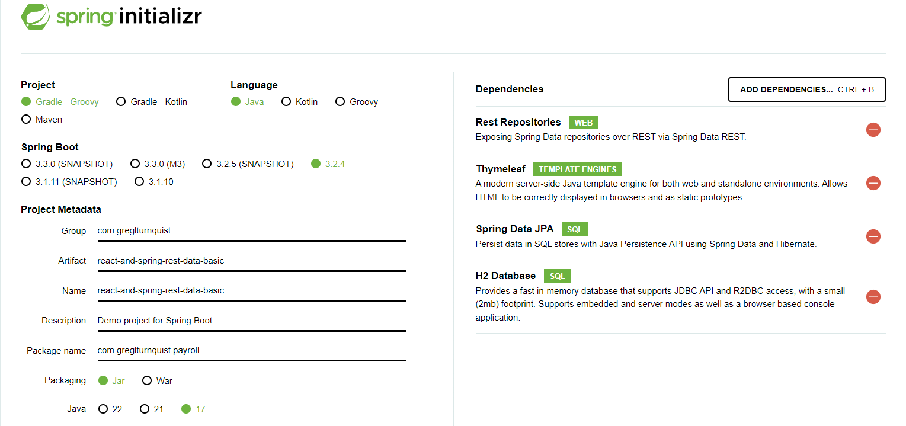

# CA2: Build Tools with Gradle

Start Date: 4, April

End Date: 17, April

[Git Repository](https://github.com/SwitchQA/devops-23-24-JPE-1222637)

## Part 2: Build Tools with Gradle

* Create a new branch called tut-basic-gradle using the following command
```cmd
git checkout -b tut-basic-gradle
```

* Use https://start.spring.io to start a new gradle spring boot project with the following dependencies: Rest Repositories; Thymeleaf; JPA; H2
* Use the following image as reference



* Extract the generated zip file inside the folder ”CA2/Part2/” of your repository. 
* We now have an ”empty” spring application that can be built using gradle. 
* You can check the available gradle tasks by executing ```cmd./gradlew tasks.```
* Delete the src folder. We want to use the code from the basic tutorial
* Copy the src folder (and all its subfolders) from the basic folder of the tutorial into this new folder.
* Copy also the files webpack.config.js and package.json
* Delete the folder src/main/resources/static/built/ since this folder should be generated from the javascrit by the webpack tool.
* You can now experiment with the application by using ```cmd ./gradlew bootRun.```
* Notice that the web page http://localhost:8080 is empty! This is because gradle is missing the plugin for dealing with the frontend code!

** IMPORTANT**

* Change imports in Employee.java *javax* to *jakarta*
* Add ```json "packageManager": "npm@9.6.7", ``` to package.json
* Add one of the following lines to the plugins block in build.gradle (select the line according to your version of java: 8, 11 or 17)
```groovy
id "org.siouan.frontend-jdk8" version "6.0.0"
id "org.siouan.frontend-jdk11" version "8.0.0"
id "org.siouan.frontend-jdk17" version "8.0.0"
```

* Add also the following code in build.gradle to configure the previous plug-in:
```groovy
frontend {
nodeVersion = "16.20.2"
assembleScript = "run build"
cleanScript = "run clean"
checkScript = "run check"
}
```

* You can now execute ```./gradlew build```. The tasks related to the frontend are also executed and the frontend code is generated.
* You may now execute the application by using ```./gradlew bootRun```

* You may now execute the application by using ```./gradlew bootRun```

* Add a task to gradle to copy the generated jar to a folder named ”dist” located a the project root folder level
```groovy
task copyJarToDist(type: Copy) {
	dependsOn build
	from('build/libs')
	into('dist')
	include('*.jar')
	doFirst {
		// This will ensure the dist directory is created if it doesn't exist
		file('dist').mkdirs()
	}
}
```

* Add a task to gradle to delete all the files generated by webpack (usually located at src/resources/main/static/built/). 
* This new task should be executed automatically by gradle before the task clean.

```groovy
task cleanWebpack(type: Delete) {
    delete 'src/main/resources/static/built/'
}

clean.dependsOn cleanWebpack
```

* Finally run ```./gradlew clean```

#### Step 3: Alternative 

* Ant is implemented on a separate published branch and not merged with main because it's not concluded.

